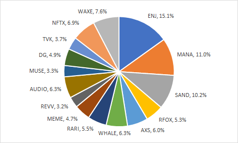

## Simple Summary

This IIP relates to launching the Metaverse Index with an updated methodology as described below. This will be the first index product to be launched from within the Coop community and not with an external partner as the methodologist. It is designed to capture the potential upside of the new but growing group of projects on Ethereum that relate to virtual ownership through NFTs, gaming, virtual reality and entertainment.

## Motivation

It’s clear there is strong demand for an index in this sector, PieDAO recently voted [to launch PLAY index](https://snapshot.org/#/piedao/proposal/QmXu9ecN2xovW2sucHK4ny4PRBrytdXuyFTtxk4MP1Du7G), PowerPool are considering [an NFT index](https://gov.powerpool.finance/t/powerpool-nft-index-powered-by-damm/776) and Indexed are discussing [the NFTI index](https://forum.indexed.finance/t/application-for-the-nfti-index/527). The Index Coop has to ensure we have a well thought out product ready to capture market share as the space continues to grow.

Taken directly from Piers Kicks’ article [Into the Void](https://metaversed.net/Into-The-Void-Where-Crypto-Meets-The-Metaverse-263f1ff8c13c455ea472f5689e01acaa), we envision the metaverse to be:

_“A persistent, live digital universe that affords individuals a sense of agency, social presence, and shared spatial awareness, along with the ability to participate in an extensive virtual economy with profound societal impact.”_

The opportunity here is to create an index that rewards long term investment in a decentralized and virtual future. The Metaverse Index is designed to take a view that the future of entertainment, sports and business will shift to a virtual environment and that economic activity will take place on the Ethereum blockchain within this metaverse.

## Specification

### Size of the opportunity?

Unlike the current craze for yield and the narrative of blockchain replacing traditional financial systems, the gaming/VR sector is flying somewhat under the radar. If we look at the mainstream gaming market, it’s currently valued around $155b (2020) predicted to rise to [$200b by 2023](https://www.forbes.com/sites/mattgardner1/2020/09/19/gaming-industry-value-200-billion-fortnite-microtransactions/?sh=1e6c472a2bb4). A quick back of the envelope calculation for the top 5 crypto gaming projects (using MANA, ENJ, SAND, UOS and CUBE) gives a market cap of roughly $360m, that’s 430x smaller…

In terms of holding virtual meetings and other remote working opportunities, ZOOM’s market cap [rose above $100b](https://finance.yahoo.com/quote/ZM/) in 2020. What happens when we are all meeting in the local Decentraland office? Crypto educator Alex Saunders of Nuggets News recently constructed a HQ in Decentraland and established businesses like Rarible and Matic [have been there for a while](https://decentraland.org/) (take a walk over to crypto valley). In the last year there have been a number of forums and conventions held in Decentraland and prominent figures in the crypto space continue to use it as a way to engage with followers.

Aside from gaming and the virtual meetings that can take place inside these projects, there is also the ‘virtual object’ aspect, underpinned by Non Fungible Tokens (NFTs). According to research from Messari, sales volume for NFTs is around $150 million and metaverses make up roughly a third of that.

So what is the actual value of these virtual worlds? Annual subscription revenues for World of Warcraft are in the $200 - $300 million range. At the same time, the North American MMO (massively multiplayer online) industry generated total revenue of $2.5 billion in 2016.

In Somnium space, Decentraland and Sandbox it is possible to use each project’s tokens to purchase objects or land as NFTs. Enjin went as far as creating a technology that allows user created content to move between games, something not seen in the worlds of Sony or Microsoft. This adds some depth to $MVI as the underlying tokens represent more than just face value, they are a substrate for virtual creativity.

### How is it different from other products?

$MVI is a straightforward bet on the world moving to a more virtual environment to conduct both business and pleasure.

In terms of differentiating from other products that exist this isn’t a yield farming play, it functions more like a traditional equity ETF in that it simplifies the expression of a particular trade. In this case the belief that virtual environments hold huge growth potential over the coming years. A similar product in the tradFi world is the [Van Eck e-sports ETF](https://www.vaneck.com/etf/equity/espo/overview/).

### Liquidity Analysis

The market liquidity for potential inclusions is considered during the screening process and is incorporated into the final portfolio weights via liquidity weighting. We have a live Dune dashboard that measures Uniswap liquidity of the underlying tokens over time (soon to include Sushiswap and Balancer), ready to be used during the determination phase prior to each monthly rebalance. We are also using root cap weighting methodology, which should dampen the magnitude of monthly rebalances.

### Methodology

Selection of the $MVI tokens would be based on the following basic criteria:

- The token must be available on the Ethereum blockchain.
- Protocol must be in one of the following token categories on Coingecko: Non Fungible Tokens, Entertainment, Virtual Reality, Augmented Reality and Music. More categories can be added in the future as the market matures.
- Total market cap must be over $30m.
- Protocol must have at least 3 months history of operation and its token must have at least 3 months of price and liquidity history.
- Token must have reasonable and consistent DEX liquidity on Ethereum.
- An independent security audit should have been performed on the protocol and results reviewed by the product methodologist. In the case that no audit has been performed, the methodologist will apply subjective judgement of the protocol based on assessment of the criteria above and communications with the team.
- In the event of a security issue the methodologist should work with the project team to understand the issue and any effects to the $MVI holdings. The team would be expected to provide users of the protocol with a reliable solution and adequate documentation to ensure transparency about the incident.
- Tokens will not be staked at the launch of the index. This is subject to change as liquidity increases and it becomes possible to safely generate yield through staking.

### Index Weight Calculation

The $MVI will use a combination of root market cap and liquidity weighting to arrive at the final index weights. We believe that liquidity is an important consideration in this space and should be considered when determining portfolio allocation.

TW = 75%*RMCW + 25%*LW

where,

TW – token weight in the $MVI

RMCW – square root of market cap weighted allocation

LW – liquidity weighted allocation

### Index Maintenance

The index is maintained monthly in two phases:

- Determination phase: During the determination phase, the tokens being added and deleted from the index calculation are determined during the final week of the month and published before monthly rebalancing.
- Rebalancing phase: Following publication of the determination phase outcome, the index composition will change to the new weights during the first week of the following month.

The index is maintained monthly in two phases:

### Draft Portfolio (as of March 16)

### Fees

The Metaverse Index will have a streaming fee of 0.95% (95 basis points). The revenue generated from the streaming fee will go entirely to Index Coop and the methodologist will forfeit the methodologist bounty, which will accrue to the Index Coop Treasury instead.

## Author background and commitment

DarkForestCapital has been a member of the Index Coop community since the beginning, initially proposing the Metaverse Index within the first week of the Coop launching. Since then DFC has joined the treasury committee, produced the newsletter and more recently looked to improve Index tokenomics.

Verto arrived on the scene more recently but got straight to work making improvements, firstly launching the Investment Committee to improve our content and analysis while also reaching out to wallets and exchanges for partnership. Verto took the original Metaverse proposal and reworked the weighting calculation to overcome the low liquidity that some of the tokens experience, making the idea into a reality.

Mason Nystrom is a research analyst at [Messari](https://messari.io/) specialising in NFTs, social tokens and the metaverse. Mason will provide fundamental analysis as an overlay to the methodology and criteria specified above.

## Copyright

Copyright and related rights waived via [CC0](https://creativecommons.org/publicdomain/zero/1.0/).
