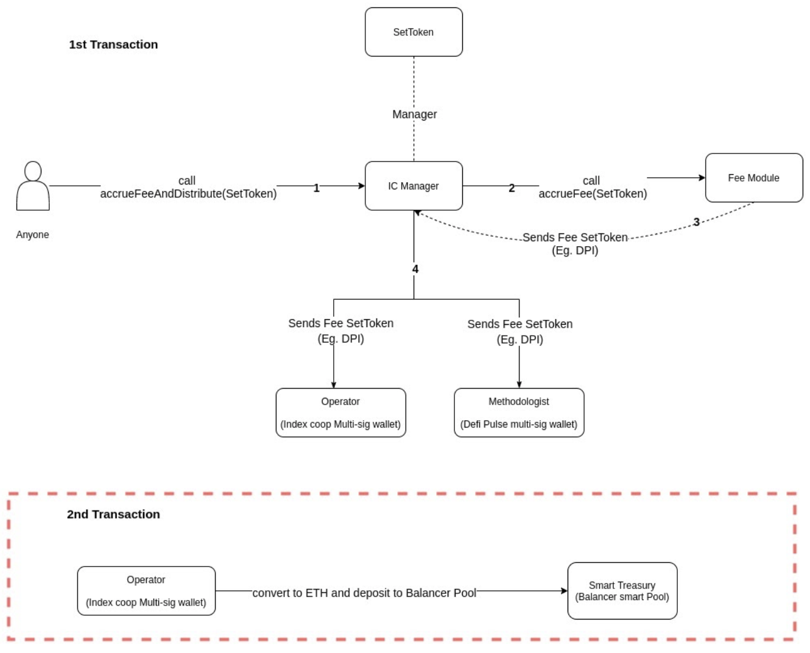

## Summmary

Deploy a Balancer Smart Pool with $500k from the community treasury to pilot a [buy-back-and-make model](https://www.placeholder.vc/blog/2020/9/17/stop-burning-tokens-buyback-and-make-instead) for improving INDEX tokenomics, with an option to extend after 3 months based on program success.

## Abstract

**Issue**: Looking for a function to accrue value to INDEX tokens that is gas/tax efficient and allows the Index Coop to retain income for reinvestment during the growth phase.

**Solution**: Deploy a smart balancer pool for a portion of our treasury as an automated buy-back mechanism for the INDEX token.

**Why**:

- Streaming fees accrue value directly to INDEX tokens via the automated buy-back mechanism
- Maintains a fixed amount of treasury diversification because of fixed pool weight
- Sustainability in terms of being able to reward contributors from the pool into the future
- Increased market liquidity
- Improved treasury transparency
- Traders pay us to rebalance the pool by arbitraging the price difference after a deposit/withdrawal. [Further reading](https://balancer.finance/whitepaper/)

**How**: 80/20 INDEX/ETH Balancer smart pool

**Immediate Effect**: $100k DPI swapped to ETH, combine with $400k INDEX from treasury committee wallet and seed the pool. Manually sell DPI streaming fees to ETH and deposit into the pool over the following 3 months.

Implementing this proposal would involve the creation of a balancer smart pool that only a whitelisted controller contract (in this case the Index Coop multi-sig) can interact with. We will deploy the pool through Balancer’s GUI using the parameters set out in the Specification section below. This will provide enough funds to cover 6 months of reward contributions plus sufficient liquidity to encourage arbitrage trades.

We will be able to monitor the performance of the pool and determine slippage, trading fees and Balancer rewards. The data can be used to project if this is worthwhile scaling up and adopting on a permanent basis, as well as how to best adjust the trading fee parameter for optimal growth.

* **FOR** - Pilot the Balancer Smart Treasury for 3 months. Deploy a balancer pool with 80/20 INDEX/ETH composition seeded with 500k USD INDEX/ETH equivalent. Temporarily redirect the Index Coop portion of DPI streaming fees to the Balancer Smart Treasury.

* **AGAINST** - Do not deploy a smart treasury according to the parameters above.

## Specification - Initial

Weight: 80/20 INDEX/ETH

Liquidity: $500k seeding ($400k INDEX, 100k ETH), further liquidity added via DPI converted to ETH

Swap fee: 0.3% (can be changed)

Cost: Negligible, gas fees are reimbursed for deployment

Scope of work: deploy via GUI, manually sell streaming fees for ETH and deposit in the pool.

Configurable rights:

canPauseSwapping - TRUE

canChangeSwapFee - TRUE

canChangeWeights - TRUE

canAddRemoveTokens - TRUE

canWhitelistLPs - TRUE

canChangeCap - FALSE, allows flexibility to add any amount of liquidity

## Specification - >3 months

Weight: 80/20 INDEX/ETH

Liquidity: $1.5m, with plans to add further liquidity via all live product streaming fees

Swap fee: 0.3% (can be changed)

Cost: Development (minimal), contract spec below

Scope of work: Develop a contract to convert streaming fees to ETH and deposit into smart treasury (shown in red box below).

## Background:

Treasury Strategy is currently being guided by Treasury Questionnaire [Pt. 1](https://gov.indexcoop.com/t/treasury-questionnaire/596) and [Pt 2](https://gov.indexcoop.com/t/treasury-questionnaire-pt-2/716)

Forum Post: [Adopt a Smart Treasury](https://gov.indexcoop.com/t/adopt-a-smart-treasury/726)

Google Doc: [Treasury Goals](https://docs.google.com/document/d/1LcP0DkuMdNrPTj4sBWXBD9hJMf7fp5uDh0F_-wIj9uo/edit#)

Example: [AAVE smart pool](https://pools.balancer.exchange/#/pool/0xc697051d1c6296c24ae3bcef39aca743861d9a81/about)

Example: [IDLE Finance](https://gov.idle.finance/t/iip-2-add-a-smart-treasury-to-idle/211/7)

## Copyright

Copyright and related rights waived via [CC0](https://creativecommons.org/publicdomain/zero/1.0/).
