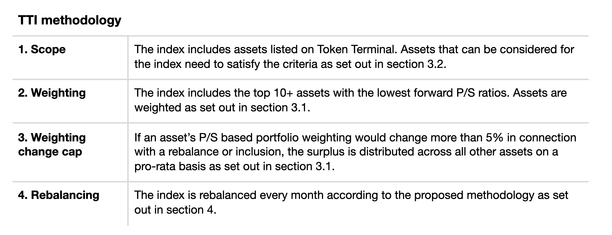
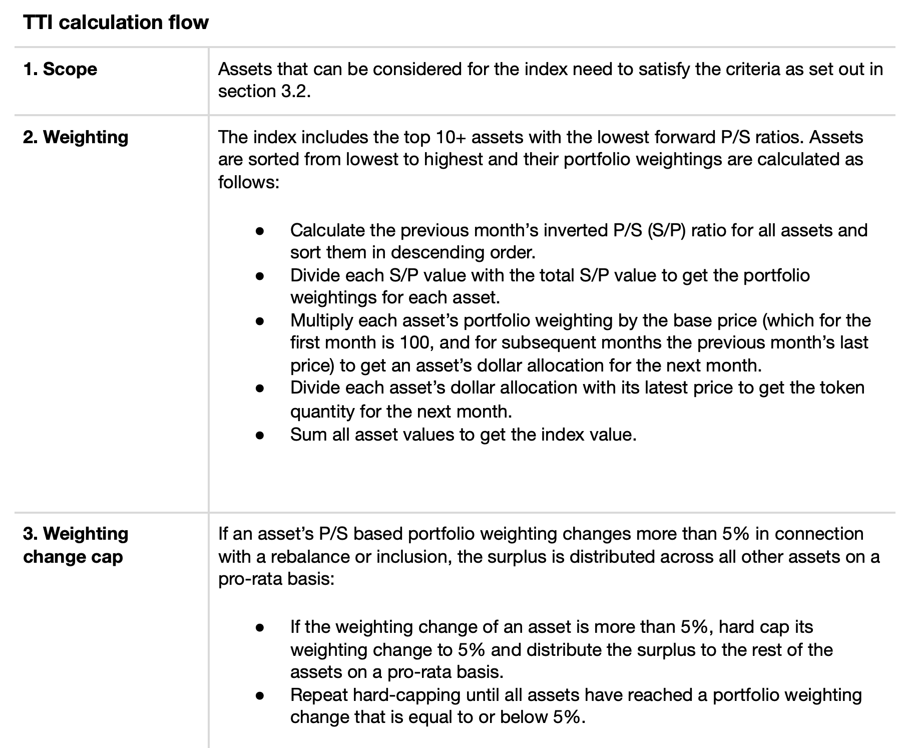

## Simple Summary

A price to sales ratio (P/S) weighted smart beta index by Token Terminal (TTI). Token Terminal wishes to contribute to the Index Coop product offering by proposing a fundamentals-weighted index to complement the current market cap-weighted index provided by DeFi Pulse (DPI). Given the Index Coop’s mission to expand its product offering, we feel that our proposed index product would be well-aligned with the overall goals of the Index Coop community.

Token Terminal is a leading data analytics provider focused on the fundamentals of crypto protocols. We track metrics such as revenue and earnings to gauge the actual usage and performance of different crypto protocols. Over the past six months, we’ve witnessed increasing interest towards our chosen methodology and believe that a broadly available index product based on that same methodology could generate significant interest among the community.
Token Terminal could become a key member of the Index Coop community. The product roadmap for Token Terminal includes the addition of several new protocols and metrics, which means that over time, we would be able to provide indexes for several different products, should there exist demand for additional indexes.

## Objective

Smart beta. In contrast to traditional market cap-based indexes, smart beta indexes employ alternative index construction rules with the aim of improving a portfolio’s risk-adjusted returns. These indexes seek to combine the benefits of passive investing and the advantages of active investing strategies.
Token Terminal smart beta index (TTI). The TTI uses a fundamentals-based ruleset for its index construction. Assets included in the TTI are chosen primarily based on their price to sales ratio.
The price to sales ratio compares a protocol’s market cap to its revenues. A low ratio could imply that the protocol is undervalued and vice versa. The price to sales ratio is an ideal valuation method especially for early-stage protocols, which often have little or no net income. Given the nascency of the crypto market, we believe that the price to sales ratio offers a highly accurate tool for relative analysis between different crypto protocols.

## Size of opportunity

Our institutional clients have expressed an interest towards an index product that is easily understandable for investors coming from traditional finance. The value proposition of a P/S based index is that it optimizes for fairly valued and widely used protocols and thus lowers the threshold for institutional investors looking to gain exposure to decentralized finance (DeFi). We believe that the next cycle of crypto adoption will be driven more by fundamentals than the previous cycles.

### Differentiation

Market cap-based indexes like the DPI offer a low-cost and easily accessible alternative for investors looking to diversify their cryptoasset exposure. We believe that the TTI could serve as a great fundamentals-based complement to the DPI and over time, especially as the crypto market and the asset universe expand, evolve to offer its investors differentiated exposure to revenue-generating and fairly valued crypto protocols.

## Methodology

### Index calculations

TTI uses a forward price to sales ratio that is calculated based on a protocol’s past 30-day average revenue. Formula for the forward price to sales ratio: fully diluted market cap / annualized revenue (calculated as a simple 30 day moving average \* 365).

### Token inclusion criteria

Eligible tokens are those that meet the following technical, market and safety requirements:

#### Technical requirements

- The token must be available on the Ethereum blockchain.
- The token must be listed on Token Terminal.
- The token must not be considered a security by the corresponding authorities across different jurisdictions.
- The token must be the native token of a protocol.

#### Market requirements

- The token must have a capped supply or it must be possible to reasonably predict the token’s supply over the next five years.
- The token must have sufficient liquidity for initial inclusion and rebalances.
- The token’s economics must not have locking, minting or other patterns that would significantly disadvantage passive holders.

#### Safety requirements

- The protocol must have been launched at least 90 days before inclusion.
- The protocol must be recognised as having a high-quality product and team.
- The protocol must have sufficient resources for future development.
- The protocol must be actively developed and must not be insolvent.
- The protocol must have conducted sufficient security audits and/or security professionals must have reviewed the protocol to determine that security best practices have been followed.

## Index maintenance

TTI would be maintained monthly in two phases:
**i) Determination phase**
The determination phase takes place during the last week of the month. It is the phase when the changes needed for the next reconstitution are determined.

- Price to sales ratio determination: TTI references Token Terminal’s price to sales ratio. The price to sales ratio is determined during the last week of the month and published before the monthly reconstitution.
- Additions and deletions: The tokens being added and deleted from the index calculation are determined during the last week of the month and published before the monthly reconstitution.
  **ii) Reconstitution phase**
  The index components are adjusted, added and deleted as per the instructions published after the end of the determination phase. New index weightings, additions and deletions are incorporated into the index during the monthly reconstitution, which will take place on the first business day of the month. As assets tracked by the index grow, the reconstitution window will expand to more than one day to lower the reconstitution’s market impact.

## Author background and commitment

This proposal has been drafted by the founding team at Token Terminal. Token Terminal was launched at the end of 2019 with the aim to create institutional-grade analytics tools for cryptoasset investors.
Token Terminal wishes to contribute to the Index Coop in the role of a methodologist. The product roadmap for Token Terminal includes the addition of several new protocols and metrics, which means that over time, we would be able to provide indexes for several different products, should there exist demand for additional indexes. As a methodologist Token Terminal would:

- Provide an initial but complete methodology for the proposed index.
- Provide all necessary data for the maintenance of the proposed index.
- Track and monitor the data provided for the maintenance of the proposed index.
- Propose new assets to be added to the index product in accordance with the inclusion criteria.
- Collaborate with the Index Coop in all aspects related to the proposed index.
- Use its best efforts in marketing and distribution of the proposed index.
- List the proposed index on Token Terminal’s website.
- Update Token Terminal’s community (Twitter / Newsletter) on index products offered by the Index Coop.
- Launch a dashboard (on Token Terminal’s new portal) that includes all index products offered by the Index Coop.
