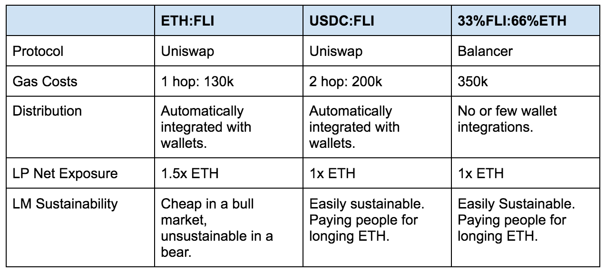

# Simple Summary

Start liquidity mining incentives for the ETH2x Flexible Leverage Index (ETH2x-FLI) Set for 30 days.

# Abstract

Create a new $INDEX liquidity mining program for the ETH2x Flexible Leverage Index Set with the following parameters:

1. Asset pair will be ETH2x FLI:USDC to maintain a net 1x ETH long ratio for LPs.
2. Programme runs for 30 days (starting 24 hours after the FLI launch).
3. Programme will use a new Smart Contract with the same functionality as the one currently used for DPI liquidity mining.
4. Programme will have an issuance targeting certain pool parameters described below and calculated using the 20-day average price of $INDEX prior to launch.

# Motivation

The ETH2x FLI will be the first leverage token of its kind. It will allow retail traders to access leverage without having to worry about the overhead required in maintaining their position. Because it is a token that is meant to be traded and not held long term, transaction costs to buy the ETH2x FLI need to be minimized in order to keep the retail audience.

Currently, to mint an ETH2x FLI costs almost 4x as much as buying off of Uniswap. This will still be tenable to larger retail investors, but not accessible to the broader base. A highly liquid initial secondary market would help FLI achieve it's product vision.

Secondary Market Parameters Consideration:

_Assumption: People will want to buy an ETH leverage token using ETH._

Given the above, we believe the USDC:FLI pair on Uniswap is the correct choice because:

1. Digestible 50% increase in gas costs relative to ETH:FLI on user assumption.
1. Afforded the distribution Uniswap gets.
1. Sustainable LP pool.

The Uniswap pool will calculate the issuance of $INDEX based on the trailing 20-day price of $INDEX prior to launch targeting the following parameters:

1. A Uniswap pool of $5M
1. 2% depth of $100k
1. Target APY of 20%

At an $INDEX price of $18 (not the final number), this would equate to 4629.63 INDEX, or about $83k/month.

An interesting thing to note is that the net exposure of the pool will be 1x ETH. This means that a LP can earn trading fees for simply being long ETH! We should see this pool develop a deep organic liquidity base after a kick start for the launch.

A secondary reason is for the marketing and customer acquisition benefits of running a liquidity mining program. As we saw with DPI, we were able to keep supply of DPI up while we slowly reduced incentives. Similarly, with ETH2x FLI, the liquidity mining program will serve to expose the product to a large initial customer base, a majority of whom will continue to use the product even as rewards are reduced.

**FOR**

- Start liquidity mining incentives for the ETH2xFLI set according to the parameters above.

**AGAINST**

- Do not start liquidity mining incentives for the ETH2xFLI set according to the parameters above.

# Copyright

Copyright and related rights waived via CC0.
