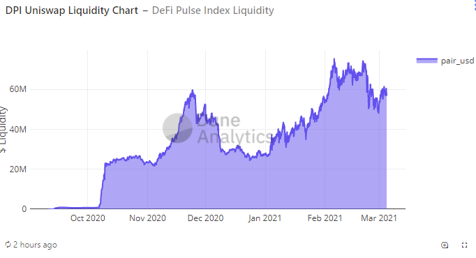

## Simple Summary

Extend INDEX liquidity mining incentives for the DeFi Pulse Index (DPI) Set using the DPI/ETH Pool for 30 days with a lower (44% reduction) issuance rate or 700 per day.

## Abstract

Extend the current INDEX liquidity mining program for the DeFi Pulse Index Set with the following parameters:

- Uniswap Programme runs for 30 days (from ~12PM PDT, March 10th 2021 to ~12PM PDT, 12th April 2021).
- Uniswap programme will use the same staking contract as IIP-11, -13 and -14 to remove the need to unstake and restake.
- Uniswap programme will have reduced issuance rate (700 vs 1,250) compared to IIP-14 (a 44% reduction)
- 21,000 total INDEX is to be distributed, representing 0.21% of total INDEX.

## Motivation

The DeFi Pulse Index currently has high liquidity on the Uniswap ETH - DPI pool. This is in part due to the liquidity mining incentive program. High Uniswap liquidity allows users and third party integrators to confidently enter and exit DPI positions.

The current liquidity mining incentive program ends on March 8th. This proposal seeks to extend liquidity mining incentives with a new liquidity mining program to continue growing distribution and adoption of the DPI.

_However, it is planned to eventually stop the $INDEX funded liquidity mining programme, with long term liquidity provided by the trading fees (and 3rd party mining incentives). This will mean that $DPI becomes 100% unincentiviesd by the coop - currently ~75% unincentivised_

**History of $INDEX liquidity mining**
The change from 15,000 to 3,864 INDEX per day in December was accompanied by a significant drop in liquidity in the pool. However, the reduction from 3,864 to 2,500 at the start of January did not result in a similar effect and with the recent increase in both $DPI and $ETH prices, the liquidity pool has grown. The further reduction in February rewards also had little impact (compared tot he price action in late Feb) _(The use of the same staking contract meant that no action was required to continue the farm which probably helped retention)_

### KPI’s

The key KPI for this proposal is that there will remain over $30 M liquidity in both Uniswap and Sushiswap $DPI: $ETH pools.
A secondary KPI will be that the % fees from trading volume will grow for the Unidwap pool as trade volumes increase combined with a reducing pool size.

#### **FOR**

- Extend liquidity mining incentives for the DPI set according to the parameters above.

#### **AGAINST**

- Do not extend liquidity mining incentives for the DPI set according to the parameters above.

## Specification

### Overview

The deployed smart contract being used for the current liquidity mining programme on Uniswap can be extended, but only for the same time period.

Existing stakers on Uniswap need to take no action.

New stakers would need to:

1. Users deposit ETH and DPI into the Uniswap ETH - DPI pool and receive Uniswap ETH DPI LP tokens.Or Sushi pool to receive SLP tokens.
2. Users deposit their Uniswap ETH DPI LP tokens into the proposed Index Coop liquidity mining contract. as appropriate.
3. Users receive INDEX tokens in proportion to the quantity of ETH DPI LP / SLP tokens deposited.
