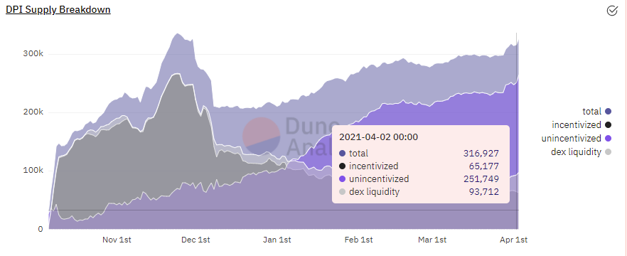

## Simple Summary

Extend INDEX liquidity mining incentives for the DeFi Pulse Index (DPI) Set for 30 days with an unchanged issuance of 700 INDEX per day.

In addition, authorise the Product and Treasury WG's to run 2 further 30 day liquidity mining campaigns targeting $55M on uniswap v2.

## Abstract

Extend the current INDEX liquidity mining program for the DeFi Pulse Index Set with the following parameters:

- Uniswap Programme runs for 30 days (from ~12PM PDT, April 9th 2021).
- Uniswap programme will use the same staking contract as IIP-11, -13 and -14 to remove the need to unstake and restake.
- Uniswap programme will have unchanged issuance rate (700 vs 700)
- 21,000 INDEX represents 0.21% of total issuance.
- INDEX rewards will be adjusted by the Treasury and Product WG's to target $55 M in the staking contract.

## Motivation

The DeFi Pulse Index currently has high liquidity on the Uniswap ETH - DPI pool. This is in part due to the liquidity mining incentive program. High Uniswap liquidity allows users and third party integrators to confidently enter and exit DPI positions.

The current liquidity mining incentive program ends on April 9th. This proposal seeks to extend liquidity mining incentives with a new liquidity mining program to continue growing distribution and adoption of the DPI.

Previous liquidity mining campaigns have progressively cut the index rewards to maintain liquidity while avoiding releasing too many INDEX tokens (which reduces the coops treasure and produces sell pressure on INDEX).

However, [discussions within the community](https://gov.indexcoop.com/t/simultaneous-liquidity-mining-things-to-consider/1111) have highlighted that continuing reduction in INDEX may not be the optimal approach at this time. In addition it is recognised that the current 30 day cycle eats governance attention and creates uncertainty for our LP's

Factors contributing to the desire to maintain a large Uniswap v2 Pool with an extended time horizon include:

1. Wanting to ensure that $DPI dominates the liquidity for the DeFi fund sector.
2. Wanting LP's to have security that they can sit in the DPI:ETH staking contract and enjoy passive LP rewards.
3. Ensuring that while coop, customer, and LP attention is focused on our new products (CGI, MVI, ETH2-FLI) and associated liquidity mining campaigns, we ensure that DPI liquidity is maintained.
4. Preventing cannibalisation of DPI liquidity as other product are launched and boot strapped with INDEX rewards.
5. The impact of Uniswap v3 on liquidity, and how we can maintain it in the future.

**DPI supply and liquidity**

~19% of the total DPI supply (65 k) is currently being incentivised by INDEX tokens.
A further ~ 12% of total supply (27 K) is sitting in liquidity outside the coop staking contract (7% Uni, 3% Sushiswap, 2% Loopring).

The uniswap pool currently contains $56 of liquidity supported by INDEX incentives.

**Ongoing works**
Work is ongoing to activate intrinsic productivity contracts to capture more income from DPI (which may be used to incentivise the liquidity pool). However, this is a longer-term goal for the coop

In addition, work is underway to allow easier access to exchange issue and redemption for large purchasers.

**Extension beyond 30 days**

After 25 days of the continued liquidity mining, the Product and Treasury Working Groups would review the average value of liquidity in the staking contract over the previous 7 days and agree on the ongoing reward rates for the next 30 day period.

If the pool is above the $55 M target the INDEX rewards for the 2nd 30 day period (i.e. day 31 to 60) would be reduced proportionately (with a minimum of 500 INDEX per day), if it is below $55 M, then INDEX would be increased (with a maximum of 1,000 per day).

The same procedure would apply for days 61 to 9. However, these would have a lower cap of 300 INDEX per day and an upper cap of 1,000 INDEX per day.

The aim of this procedure is to maintain the liquidity and to help long term planning by LP's while minimising governance demands on the coop.

### KPI’s

The key KPI for this proposal is that there will remain over $55 M liquidity in the Uniswap $DPI: $ETH pools for the next 90 days

#### FOR

- Extend liquidity mining incentives on Uniswap at 700 INDEX per day, and continued mining for days 31 to 90 targeting $55 m in the pool according to the parameters above.

#### AGAINST

- Do not implement this proposed extension.

## Specification

### Overview

The deployed smart contract being used for the current liquidity mining programme on Uniswap can be extended, but only for the same time period.

Existing stakers on Uniswap need to take no action.

New stakers would need to:

1. Users deposit ETH and DPI into the Uniswap ETH - DPI pool and receive Uniswap ETH DPI LP tokens.
2. Users deposit their Uniswap ETH DPI LP tokens into the proposed Index Coop liquidity mining contract.
3. Users receive INDEX tokens in proportion to the quantity of v2 Uniswap ETH DPI Liquidity Pool tokens.
