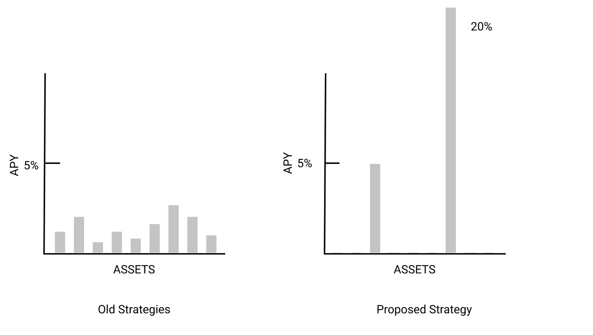

## Summary

This is a concrete and actionable plan to start earning yield on 2 assets within DPI - SUSHI and YFI.

The yield strategies proposed avoid all the issues discussed previously - namely liquidity issues from lending and potential loss of funds by using them as backstops.

These two simple farming strategies will 3x our revenue on DPI.

## Motivation

A brief history on intrinsic productivity discussions for Coop newcomers:

- [Origins](https://gov.indexcoop.com/t/defi-accumulation-index-proposal/97)
- Initial explorations [1](https://gov.indexcoop.com/t/dpi-as-a-productive-asset/193) + [2](https://gov.indexcoop.com/t/ongoing-draft-current-state-of-discussions-around-dpi-product-upgrades/234) + [3](https://gov.indexcoop.com/t/the-2-cash-grab/195)
- INDEX as [staking backstop](https://gov.indexcoop.com/t/intrinsic-dpi-productivity-w-index-as-risk-backstop/274)
- [Community survey](https://gov.indexcoop.com/t/polls-on-staking-intrinsic-productivity-and-rewards/288) on intrinsic productivity
- [First 'real' productivity proposal](https://gov.indexcoop.com/t/a-twist-on-intrinsic-productivity-to-maximize-index-distribution-and-coop-treasury/359)

The Coop hasn't really made any progress in implementing intrinsic productivity since the first proposal by OA six months ago. I think the two main reasons are 1. We focus on putting the whole portfolio to work at once instead of picking the low hanging fruit 2. We only explored two yield options previously - lending and protocol level staking. Essentially **we were trying to overfit acceptable yield strategies that worked for all assets at once instead of finding the best yield strategies possible** for each individual asset.

The goal of this new intrinsic productivity strategy is to focus on as few assets as possible and earn as high yield as possible on them while living by the "boring" values of the Coop.

Also the main point of differentiation for all DPI competitors is that they earn yield on assets. By activating intrinsic productivity for DPI we solidify it as the premier index product in every possible aspect.

## Description

Yield strategies:

1. SUSHI → [xSUSHI](https://docs.sushi.com/products/yield-farming/the-sushibar) → [~5% APY](https://analytics.sushi.com/bar)
2. YFI → [yvYFI](https://yearn.fi/invest/0xE14d13d8B3b85aF791b2AADD661cDBd5E6097Db1) → [~20% APY](https://yearn.vision/d/CRDOk-UGk/apy-overview?orgId=1&refresh=1m&from=1616957989438&to=1617044389438&viewPanel=6) (actual vault says 30% but used number from official stats dashboard)

Both of these strategies have all the following properties:

1. Not used as a backstop with risk of slashing
2. Not lent out and 100% backed at all times for redemptions so no liquidity issues
3. No loss strategy (e.g. LPing), always get back more tokens than notional amount in DPI
4. Passive set-and-forget with auto-compounding rewards accrued to yield bearing asset directly
5. No vesting schedule on rewards
6. Long term farms that don't require crop rotations
7. Low smart contract risk with >$120M in yvYFI and >$1B in xSUSHI representing ~10% and ~45% of each tokens total supply respectively with no hacks or exploits to date.
8. Retain full governance rights of tokens while earning yield on them

If you go back through all the intrinsic productivity posts, these two strategies completely avoid all of the issues we had with utilizing underlying assets. Even better than avoiding all the issues with old strategies, they earn higher yield than any proposed strategy so far.

## DPI Productivity Revenue Projections

| Asset | DPI TVL     | % of DPI | % Staked | % APY | DPI Productivity Revenue | % Earned on DPI TVL |
| ----- | ----------- | -------- | -------- | ----- | ------------------------ | ------------------- |
| YFI   | 134,000,000 | 0.076    | 0.75     | 0.20  | 1,527,600                | 1.14                |
| SUSHI | 134,000,000 | 0.047    | 0.75     | 0.04  | 188940.00000000003       | 0.141               |

DPI streaming fee revenue = $134M TVL \* 0.65% fees = $871,000

DPI productivity revenue = $134M TVL \* 1.3% yield = $1,716,540

DPI total revenue = $2,587,540 = 297% increase in revenue

**By utilizing just ~12% of our assets under management in two very simple, low risk strategies we can 3x our revenue on DPI.**

You can play around with these numbers [here](https://www.notion.so/5bdeeeb5ef7a413491626708b5aa9b5f).

## Yield Distribution

We will use farming profits to reimburse 100% of DPI streaming fees and send all excess rewards to Coop treasury in the yield bearing token (treasury management deferred to that working group to keep this proposal simple)

With the extra 1.3% a year from DPI TVL on top of our original 0.65% streaming fee. We can reimburse all streaming fees and still increase Coop net income on DPI by 50%. This assumes APYs average out over the year to what is listed in this proposal. Both numbers listed are on the lower end that I've seen in the last couple months.

Coop yield farming income equation:

_`(1.3% yield + 0.65% coop fee - 0.95% total fee reimbursement) / 0.65% original total income = 1.5x increased income`_

Reimbursing user fees and keeping excess profit is the optimal strategy. It maximizes value to users who get best in class asset management for free while bringing in extra revenue for the Coop to do product development and add more yield strategies which can be diverted to users for additional yield later.

## Implementation Details

- Use WrapAdapter for xSUSHI that already has an [open PR](https://github.com/SetProtocol/set-protocol-v2-contracts/pull/4/files).
- Create WrapAdapter for Yearn v2 vaults to access yvYFI
- Create a IC farming manager smart contract which tracks profit in terms of tokens, balances liquid vs staking positions and sends profits to treasury and/or DPI vault (see open question about fee reimbursement)
- With [Yearn v2 vault](https://github.com/yearn/yearn-vaults/blob/master/SPECIFICATION.md)s, if you try to withdraw more than what is in the unutilized vault reserves you incur a fee. I asked Set team and they said this will be implemented by manager not in the WrapAdapter contracts directly so the Coop will have to decide what our acceptable "slippage" fee is. As far as I can tell there is nearly [$100M or 80% of YFI in the vault held in reserve](https://etherscan.io/address/0xE14d13d8B3b85aF791b2AADD661cDBd5E6097Db1) at the moment which is 20x more than we would be staking so it seems unlikely this would happen but we should have a contingency plan anyway.
- Farming program will run indefinitely until Coop votes to end or change strategies
- No industrial farming working group (yet)

## Open Questions

- _What % of funds do we stake? -_ I suggest we stake 75% of all assets in DPI with funds pulled from staking strategies to replenish reserves if less than 20% of notional amount is liquid. This leaves 20-25% of all funds available to cover rebalances and redemptions. Brian from Set said redemptions aren't an issue either because users would just receive SUSHI/xSUSHI/YFI/yvYFI instead of just SUSHI/YFI. Most importantly, we can retrieve all 75% back at any time without any risk to our positions or profitability so we should maximize yield on these two strategies. As far as I can tell from this [chart](https://duneanalytics.com/queries/20674/43240), there hasn't been more than a 6% drop in a token over a 3 day time period so this leaves us a very safe margin.
- _How is farming managed?-_ Is Farming Manager an external contract like ICManager or a Set module internal to their system? Do we create a new WrapModule instead of using existing one? Do we automate everything and have 0 human input except turning on and off productivity? Will rebalances automatically pull from farming tokens if need be or must all required tokens be liquid before rebalances occur?
- _How do we return fees to users? -_ This question is coupled with "how is farming managed?" The way Set Protool works, all farming profits would go directly to DPI holders if we implemented productivity today. So we will have to keep track of profits in an intermediary contract (Farming Manager) and distribute back profits to IC and DPI holders, keeping track of how much of streaming fees we have offset so far. We would actualize farming profits once a month right before DeFi Pulse begins calculating their rebalance to make sure the extra tokens from farming are accounted for in their calculations. We have to do this in a way that doesn't give Farming Manager or ICManager ability to arbitrarily send tokens. Note: we don't have to worry about any of this if we pass on all yield to DPI hodlers and don't try to take profits for Index Coop.
