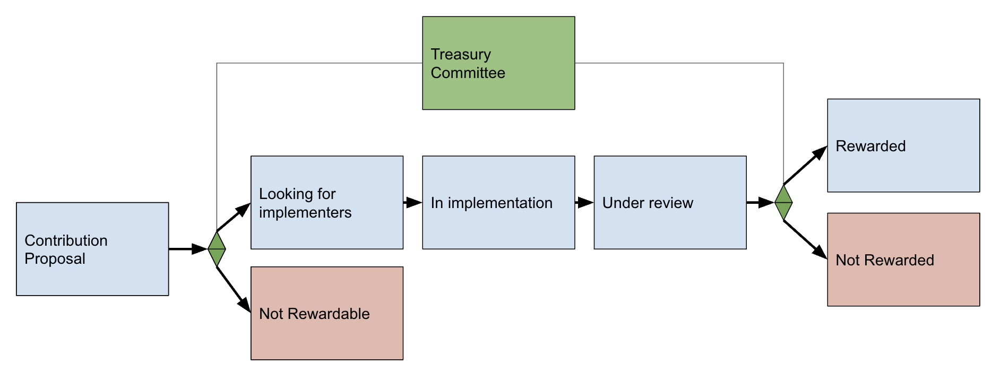

## Simple Summary

This is a proposal to create a treasury committee seeded with 10,000 INDEX tokens (approx. $30,000 at time of writing) that handles rewards distribution modeled after other early-staged communities like YFI.

## Abstract

The Index Coop doesn’t currently have a system for rewarding contributors. This proposal introduces a Lite Treasury Committee initially run by the Set team that distributes rewards to Index Coop contributors.

This IIP proposes the Treasury Committee be granted 10,000 INDEX tokens (approx. $30,000 at time of writing) dedicated to paying out contributor rewards over the next 2 - 3 months. After funds are distributed, the treasury committee will reapply for a new rewards grant to continue rewards distribution.

Future upgrades to the organization of the Treasury Committee (e.g. adding a community elected multi-sig or algorithmic contributor attribution via SourceCred) can be added in when the community is ready to add these upgrades.

## Motivation

Consistent & transparent rewards are important for acknowledging valued contributions to the Index Coop. The Index Coop does not currently have a system for determining what counts as a valuable contribution, or a system for distributing rewards for contributions deemed valuable.

We’ve tackled the first two parts of the member ownership cycle in the past two weeks, and now have the last rewards portion remaining in order to complete the contributor ownership lifecycle. Without a system to handle rewards, members may struggle to find longer term motivation to continue contributing to the community.

Other communities like YFI and Synthetix have solved this by creating a treasury committee that handles how rewards are distributed. The proposal specifies a system for the Index community off the prior work of those systems.

The treasury committee commits to values of:

* Fairness - Members should feel like the rewards they are given are fair and proportional to the contribution they’ve made.
* Sensibility - The treasury should be spent wisely for the community and goals of the community.
* Flexibility - The rewards system should take into account multiple types of contributions and varying depths of contributions (1 off bounties to longer term rewards)

To exemplify these values from the start, the treasury committee will not pay Set or DeFi Pulse team members using these funds.

**FOR**

* Create a lite treasury committee initially led by the Set team that spearheads the rewards distribution for the community.
* Initially grant the treasury committee 10,000 INDEX tokens ($30,000 at $3 / INDEX) to distribute as rewards to Index community members.

**AGAINST**

* Do not create a lite treasury committee.
* Propose a different solution for rewards distribution.

## Prior Work

This proposal pulls on prior work for community contributions from [YFI](https://gov.yearn.finance/t/september-grants-announcement/7044) and [Synthetix’s](https://blog.synthetix.io/synthetix-grantsdao/) rewards systems which have small committees to determine which contributions are rewardable and which ones are not, and Maker which uses SourceCred, an algorithmic system to determine the value of contributions.

Below is a summary of the research done into YFI, Synthetix, and Maker, all of which are at different stages of maturity in terms of community formation:

| Name | Community Age | Rewards System Takeaways|
| ---- | ------------- | ----------------------- |
| YFI  | Early         |
|      |               | YFI uses a Treasury Committee to distribute rewards. [September Grants Post](https://gov.yearn.finance/t/september-grants-announcement/7044). |
|      |               | The Treasury Committee is just Milkyklim and Banteg for now. |
|      |               | They admit that the system is flawed, and may have biases, and are brainstorming ideas around a rotating committee. |
|      |               | They pay out at the end of each month. |
|      |               | They pay long term payroll and one off bounties.|
| Synthetix | Mid      |
|      |               | Also uses a Treasury Committee.|
|      |               | Their treasury committee is a DAO called the [GrantsDAO](https://blog.synthetix.io/synthetix-grantsdao/) which is a more formal structure than YFI’s. |
|      |               | The GrantsDAO is a 4/5 Multisig that discusses and approves/denies improvement proposals. |
|      |               | Proposals are made to the GrantsDAO in a similar format to SIPs, and have a rewards amount and estimated amount of hours attached to each proposal.| |
| Maker| Late          |
|      |               | Uses [SourceCred](https://sourcecred.io/) to measure and track contributions. |
|      |               | SourceCred is an algorithmic system based off of PageRank used by Google which ranks website importance based on the amount of links that point to a given website. The algo is built to be sybil resistant.|
|      |               | They just [finished a trial of SourceCred](https://forum.makerdao.com/t/sourcecred-trial-final-report/4569), and deemed it a success. They’ve voted to extend the trial for an additional 3 months.|
|      |               | The trial was from June 1st to August 31st. |

Considering Index Coop is in early stages of community formation, we suggest a lite implementation of a rewards system similar to YFI’s with an initial treasury committee (just Milkyklim and Banteg) made up of a core team of stakeholders, in this case Set.

A system like Synthetix’s GrantsDAO may introduce too much process for an early stage community like ours, and a Maker-like system for counting rewards will require more research before implementing.

The proposed rewards system is flexible enough that eventually the community can vote on upgrades when it makes sense.

## Specification

### The Treasury Committee (Lite)

Create a treasury committee initially run by the Set team (like YFI’s rewards system) that handles rewards distribution for the community.

### Treasury Committee Grant

Seed 10,000 INDEX from the community treasury to a wallet under ownership of the Treasury Committee. These funds will be distributed to members of the community who contribute meaningfully to the Index Coop.

10,000 INDEX is the estimated amount of funds required for a 2 - 3 month trial run of the treasury committee. We can expect around 3,000 - 5,000 INDEX ($10,000 - $15,000) worth of rewards to be given out each month to contributing community members, excluding the Set or DeFi Pulse teams.

### Treasury Committee Responsibilities

* **Keep Track Of Contributions** - The treasury committee will keep track of contributions happening to the Index Coop in order to create reasonable rewards distributions.
* **Decide Reward Sizes** - The committee determines which contributions should get rewarded and by how much depending on if the contributions fall in line with the general goals of the coop, how much impact the contribution has, and how much effort the contribution required.
* **Service Contributor Appeals** - When prompted, the treasury committee will give an early indication whether or not a proposed contribution is likely to see a reward. If a contributor feels their work has not been sufficiently acknowledged, they can make an appeal to the treasury committee [here](https://setlabs.typeform.com/to/jMjgA5z3).
* **Publish Reward Distributions** - The committee will publish reward distributions at a regular cadence for contributing members. A post will be made when distributions are made similar to YFI’s rewards distribution [post here](https://gov.yearn.finance/t/september-grants-announcement/7044).
* **Distribute Rewards** - The committee will distribute rewards to Index Coop contributors.

### Rewardable Contributions

The rewardable contributions include but are not limited to:

* Product Development
  * Contributions to the [Index site repo](https://github.com/SetProtocol/index-ui).
  * Contributions to the [Index contracts repo](https://github.com/SetProtocol/index-coop).
  * Creating specs.
  * Creating designs.
* Marketing
  * Creating valuable content.
  * Recruiting and onboarding members into Index.
  * Creating community resources and/or adding to the [community Gitbook](https://docs.indexcoop.com/).
  * Index Coop product evangelism on social media channels like Twitter/Medium/Discord/Telegram.
  * Creating memes.
* BD/Growth
  * Getting integrations with other products.
  * Getting DPI/INDEX listed on exchanges.
  * Getting featured placement on wallets, exchanges, etc.
* Community Discussions
  * Discussing meaningfully on how to improve the product, culture, community, etc., of the Index Coop on the forum or discord.

### Meaningful Contributions

Only the contributions that meaningfully add to the Index Coop will be considered for rewards. What is deemed a “meaningful contribution” is up to the discretion of the Treasury Committee, keeping in mind that the Treasury Committee is openly committed to values of **Fairness**, **Sensibility**, and **Flexibility**.

If you’re wondering if your contribution is meaningful, ask these questions:

* Does what I’m doing improve the Index Coop’s product/distribution and or community?
* Is what I’m doing meaningfully moving the needle on Index’s product adoption?
  * Does it grow DPI TVL? (Assume the same for any new products we create.)
  * Does it add more DPI holders?
  * Does it promote the DPI/Index in a positive way?

### Maintaining Integrity & Follow Up Funding

After it’s funds have been expended, the Treasury Committee will apply for a new treasury grant from the community. If the Treasury Committee does a good job, the community can grant the request for funding. Alternatively, if the Treasury Committee does not do a good job, then the Index community can choose to deny the treasury grant request. The community can always propose alternative mechanisms for funding contributions.

### Rewards Flow

To illustrate the end to end reward cycle, we’ve created a diagram below. Many contributions will be ad-hoc and will not need to go through this entire flow.

1. **Contribution Proposal** - A potential contribution is proposed by a community member on the forum or Discord.
2. **Initial Eligibility Determination** - If a user proposing an improvement asks if there’d be a reward for adding a contribution, the treasury committee will chime in to say if the proposal is rewardable based on the goals of the Index community.

    1. **Rewardable** - If it is eligible for a reward, the community searches for members to implement the proposal. It’s assumed that some proposers will be the implementers.
    2. **Not Rewardable** - If it’s not rewardable, a member of the treasury committee lets the proposer know that it’s not eligible for a reward.

3. **Implementation** - The proposal goes through implementation, then is reviewed by the treasury committee.
4. **Final Review** - The treasury committee views the work and determines if it meets the bar for a reward to be paid out.

    1. **Accepted** - The implementation is accepted and a reward is paid out to the implementer.
    2. **Denied** - The implementation is deemed ineligible for the reward due to not meeting certain criteria. The implementor is asked to revise their implementation before submitting for review again.

5. **Payment** - The treasury committee sends a reward to the implementor.

## Copyright

Copyright and related rights waived via CC0